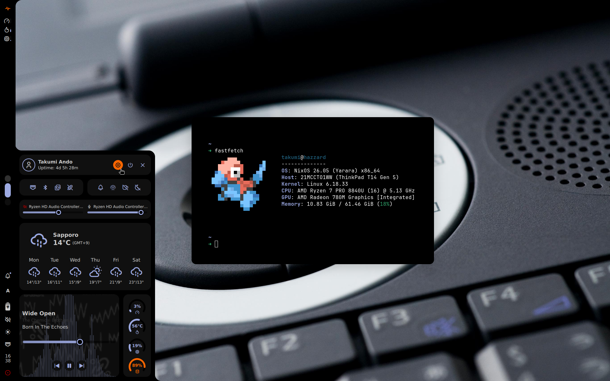

# dots



## niri desktop

The Wayland session is split into small, replaceable components:

- niri, Waybar, Vicinae, mako, awww, SwayOSD, swaylock and swayidle
- matugen is the single source of truth for every UI color
- Ghostty and GTK 3/4 (including Nautilus/libadwaita) consume the same palette

Install the dotfile links, then choose the first wallpaper:

```sh
./install
wallpaper ~/Pictures/Wallpapers/example.jpg
```

`wallpaper` stores the selected image in `~/.cache/matugen/current-wallpaper`.
On the next niri login, `niri-session` restores it, regenerates the palette and
starts the desktop services. Generated files live in `~/.cache/matugen`; the
Vicinae theme lives in `~/.local/share/vicinae/themes/matugen.toml` because that
is Vicinae's theme search path.

Required commands are `niri`, `matugen`, `waybar`, `vicinae`, `mako`, `awww`,
`swayosd-client`, `swayosd-server`, `swaylock`, `swayidle`, `brightnessctl`,
`playerctl`, `wpctl`, `gsettings`, and `jq`. GTK 3 applications use
`adw-gtk3-dark`; install that theme if it is not already available.

The default idle policy locks after 10 minutes, blanks displays after 10.5
minutes and suspends after 30 minutes. Edit `config/swayidle/config` to taste.
